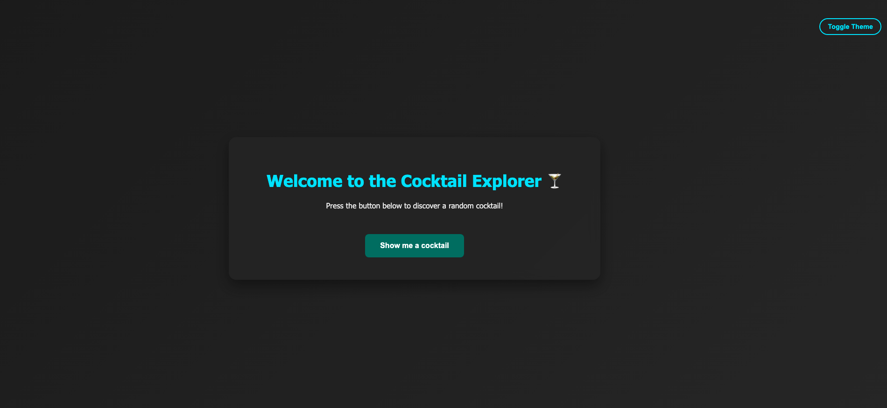
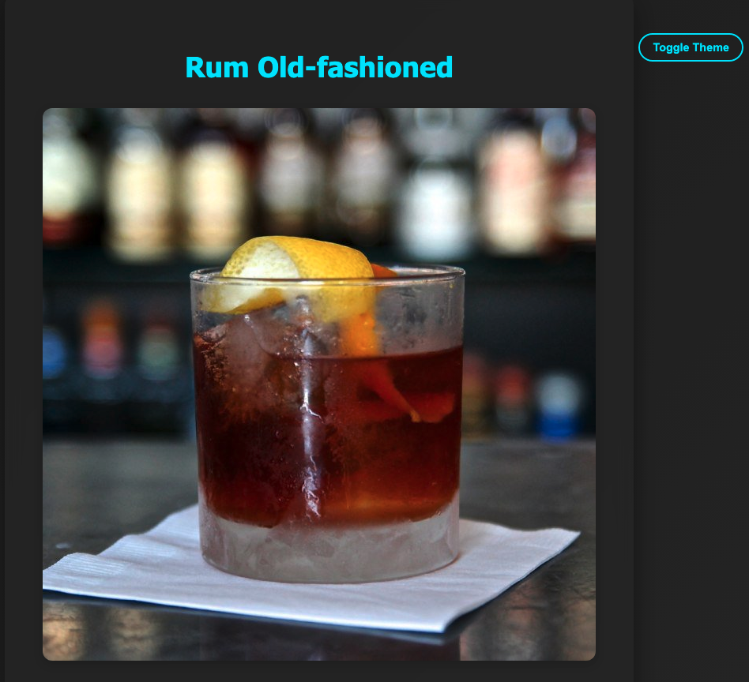
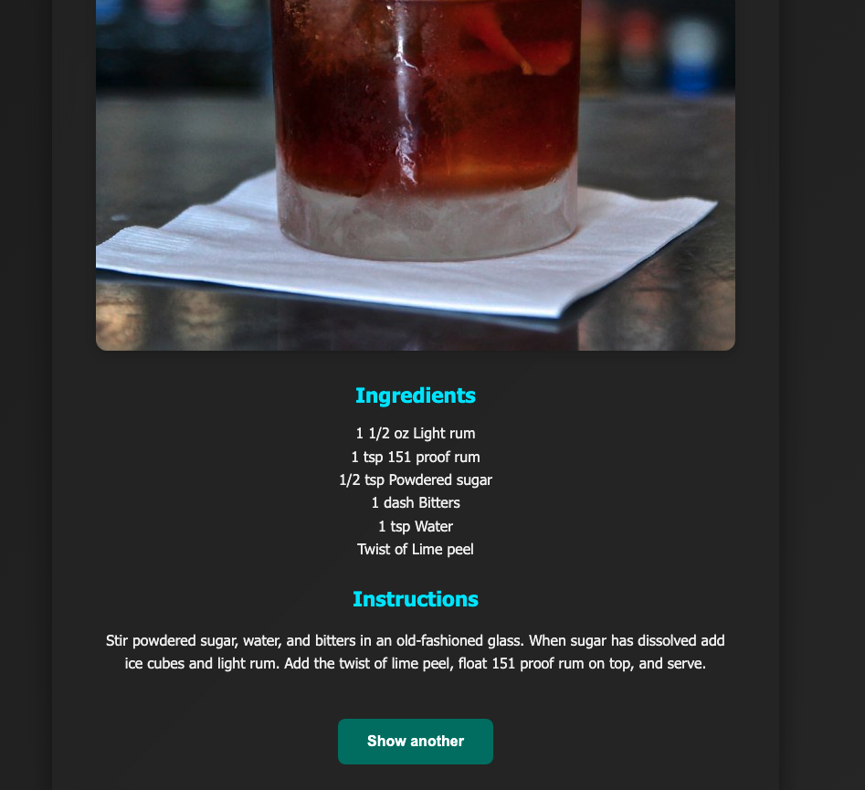

# Random Cocktail Suggester

 A modern web application that fetches and displays random cocktail recipes using [TheCocktailDB API](https://www.thecocktaildb.com/api.php).
 
 Built with Node.js, Express, Axios, and EJS, the app provides a fun and interactive interface for discovering new cocktails — complete with images, ingredients, and instructions.
 

 ## 🚀 Features
 
 - Random cocktail suggestion from TheCocktailDB 
 
 - Welcome screen with call-to-action 
 
 - Glassmorphism UI with smooth transitions 
 
 - Responsive layout for desktop & mobile 
 
 - Dark mode toggle (with theme persistence) 
 
 - Ingredient parsing and clean formatting
 

 ## 🛠 Tech Stack
 
- **Node.js** 

- **Express.js** 

- **Axios** (for API calls) 

- **EJS** (for server-side rendering) 

- **CSS3** with custom styling (glass UI + dark mode)

  
## 📂 Project Structure 

``` random-cocktail-suggester/ ├── assets/ │ └── cocktail-screenshot-1.png └── cocktail-screenshot-2.png └── welcome-screenshot.png ├── public/ │ └── styles.css ├── views/ │ ├── welcome.ejs │ └── cocktail.ejs ├── app.js └── package.json ```


## 📦 Installation
 
1. **Clone the repo** ```bash git clone https://github.com/your-username/random-cocktail-suggester.git cd random-cocktail-suggester ```
  
2. **Install dependencies** ```bash npm install ``` 

3. **Run the server** ```bash npm start ``` 

4. **Visit in your browser** ``` http://localhost:3000 ```


## 🧠 How It Works

- The root route (`/`) renders a welcome screen. 

- When the user clicks the button, it navigates to `/cocktail`. 

- Axios fetches a random cocktail from `https://www.thecocktaildb.com/api/json/v1/1/random.php`. 

- The response is parsed and passed to the EJS view for rendering.


## 🌙 Dark Mode 

- Toggle available in the top right. 

- User preference saved via `localStorage`.


## 📸 Screenshots
 
### 🧊 Welcome Page


### 🍹 Cocktail UI
 
 


## 📜 License

This project is open source and available under the MIT License.


## 💬 Feedback Have ideas to improve this project? 

Open an issue or contact me directly via [LinkedIn](https://www.linkedin.com/in/georgios-christodoulidis-6b0430102/).